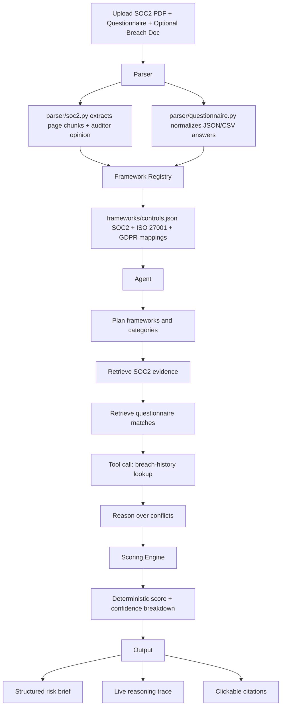

# Vendor Risk Assessment Agent

AI-powered vendor security review for the **Vultr hackathon track**.

The Vendor Risk Assessment Agent ingests a vendor's SOC2 Type II report, a completed security
questionnaire, and optional breach-history context. It produces a structured risk assessment with
per-control citations, deterministic risk scoring, confidence breakdowns, a live reasoning trace,
and follow-up questions security teams can send back to the vendor.

This project is intentionally not a basic RAG demo. The agent plans which frameworks apply,
retrieves evidence from multiple sources, calls a breach-history tool, cross-checks conflicting
evidence, and then hands the evidence to deterministic Python scoring logic. The LLM integration is
limited to document understanding and planning through Vultr Serverless Inference with the
`VultronRetriever` model.

## Why it matters

Vendor security reviews are slow because evidence lives across SOC2 PDFs, questionnaires, breach
reports, spreadsheets, and email threads. Security teams often spend days or weeks deciding whether
a vendor should be approved, remediated, or escalated. This agent compresses that workflow into an
auditable review run:

- evidence is extracted from uploaded source documents;
- framework controls are mapped to SOC2, ISO 27001, and GDPR categories;
- questionnaire answers are checked against SOC2 evidence;
- breach context is queried as a tool call;
- risk and confidence scores are deterministic, cited, and explainable.

## Architecture diagram



Equivalent text flow:

```text
Upload
  -> Parser
  -> Framework Registry
  -> Agent (plan -> retrieve -> retrieve -> tool call -> reason)
  -> Scoring Engine
  -> Risk Brief / Trace / Citation Viewer
```

## Folder-by-folder breakdown

### `/parser`

Contains source-document parsing logic. It is the first workflow stage after upload.

#### `/parser/models.py`

Defines shared parser data structures:

- `Citation`: source, location, and quoted evidence text used throughout the assessment.
- `DocumentChunk`: page-grounded SOC2 text chunk. Its `citation` property creates page citations.
- `ParsedSOC2Report`: normalized SOC2 report containing chunks, full text, and auditor opinion.
- `QuestionnaireAnswer`: one normalized answer with its row citation.
- `ParsedQuestionnaire`: normalized questionnaire and raw records.

Connections:

- Used by `parser/soc2.py` and `parser/questionnaire.py`.
- Passed into `agent/workflow.py`.
- `Citation` objects are returned by the API and rendered in the frontend citation viewer.

#### `/parser/soc2.py`

Parses SOC2 PDFs using `pypdf`.

Key functions:

- `parse_soc2_pdf(data, filename)`: extracts page text, chunks it for retrieval, and extracts an
  auditor-opinion excerpt.
- `_chunk_page(...)`: creates citation-friendly page chunks.
- `_extract_auditor_opinion(...)`: searches for common opinion language such as "in our opinion".

Connections:

- Invoked by `api/main.py` for `/assess` and `/trace`.
- Its output feeds the planning and SOC2 retrieval stages in `agent/retrieval.py`.

#### `/parser/questionnaire.py`

Parses uploaded JSON or CSV questionnaires.

Key functions:

- `parse_questionnaire_file(data, filename)`: detects JSON/CSV and returns normalized answers.
- `_load_json_records(...)`: supports raw arrays, `{ "answers": [...] }`, and single objects.
- `_load_csv_records(...)`: parses CSV rows with `csv.DictReader`.
- `_record_to_answer(...)`: normalizes common key names such as `control_id`, `question`, `answer`,
  and `evidence`.

Connections:

- Invoked by `api/main.py`.
- Its normalized answers are cross-referenced against framework categories by
  `agent/retrieval.py`.

### `/frameworks`

Contains the compliance control registry. It gives the agent a deterministic control vocabulary.

#### `/frameworks/controls.json`

JSON registry for:

- SOC2 controls: `CC6`, `CC7`, `CC8`, `A1`
- ISO 27001 controls: `A.5`, `A.8`, `A.9`, `A.12`
- GDPR articles: `Art. 28`, `Art. 32`, `Art. 33`

Each control includes:

- framework;
- control ID;
- normalized category;
- title;
- description;
- keywords used for deterministic evidence matching.

Connections:

- Loaded by `FrameworkRegistry.from_file()`.
- Used by the planner to select categories.
- Used by retrieval to match SOC2 chunks and questionnaire answers.

#### `/frameworks/registry.py`

Provides typed access to the registry.

Key classes:

- `FrameworkControl`: dataclass representation of one control mapping.
- `FrameworkRegistry`: loader and query interface.

Key methods:

- `from_file()`: loads `controls.json`.
- `list_frameworks()`: returns available frameworks.
- `by_framework(frameworks)`: filters controls by selected frameworks.
- `by_category(category)`: returns controls for a normalized category.
- `categories(frameworks)`: returns selected control categories.

Connections:

- Used by `agent/planner.py`, `agent/retrieval.py`, and `api/main.py`.

### `/agent`

Contains the multi-step agent workflow. This is the core differentiator from a RAG wrapper.

#### `/agent/models.py`

Defines workflow and output data structures:

- `AssessmentPlan`: selected frameworks and categories.
- `ControlEvidence`: SOC2 and questionnaire evidence collected for one category.
- `BreachRecord`: mocked breach-history tool result.
- `ControlFinding`: deterministic category finding, score, confidence, gaps, and citations.
- `ConfidenceBreakdown`: auditable explanation of the confidence score.
- `RiskBrief`: final structured assessment returned to the frontend/API caller.

Connections:

- Used across the planner, retriever, scoring engine, API, and frontend types.

#### `/agent/planner.py`

Plans which compliance frameworks and categories apply.

Key class:

- `AssessmentPlanner`

Key method:

- `plan(soc2, questionnaire)`: always includes SOC2, adds ISO 27001 or GDPR when the uploaded
  material references them, and selects relevant registry categories by keywords.

LLM boundary:

- If `VULTR_API_KEY` and `VULTR_INFERENCE_ENDPOINT` are configured, the planner calls the
  `VultrInferenceClient` for document-understanding/planning assistance.
- The LLM is not allowed to produce risk scores.

Connections:

- Called by `VendorRiskAgent.assess(...)`.
- Also called explicitly by the `/trace` streaming endpoint to emit planning steps.

#### `/agent/retrieval.py`

Performs two retrieval passes:

1. SOC2 evidence retrieval.
2. Questionnaire cross-reference retrieval.

Key class:

- `EvidenceRetriever`

Key methods:

- `retrieve_soc2_evidence(plan, soc2)`: matches registry keywords to SOC2 chunks and extracts
  category citations and test-result status.
- `cross_reference_questionnaire(plan, questionnaire, soc2_evidence)`: pulls corresponding
  questionnaire answers for the same categories.

Connections:

- Uses `FrameworkRegistry`.
- Returns `ControlEvidence` consumed by `scoring/engine.py`.

#### `/agent/tools.py`

Implements the breach-history tool-call boundary.

Key function:

- `query_breach_history(vendor_name, breach_document_text=None)`: mocked lookup using sample data
  and optional uploaded breach-document text.

Why mocked:

- The hackathon demo needs deterministic, repeatable behavior without relying on paid or rate-limited
  external breach intelligence APIs.
- The function is isolated so a real provider can replace the mock without changing the agent flow.

Connections:

- Called by `agent/workflow.py`.
- Called directly by `/api/main.py` for streaming trace events.

#### `/agent/vultr_client.py`

Adapter for Vultr Serverless Inference.

Key class:

- `VultrInferenceClient`

Key method:

- `complete_json(prompt, schema_hint)`: sends a JSON-oriented request to the configured Vultr
  inference endpoint using the `VultronRetriever` model.

Environment variables:

- `VULTR_API_KEY`
- `VULTR_INFERENCE_ENDPOINT`

Connections:

- Used by `AssessmentPlanner`.
- Has a safe disabled state when credentials are not configured so local demos still run.

#### `/agent/workflow.py`

Orchestrates the full assessment.

Key class:

- `VendorRiskAgent`

Key methods/functions:

- `assess(vendor_name, soc2, questionnaire, breach_document_text=None)`: executes ingest-plan-
  retrieve-retrieve-tool-reason-output.
- `to_dict(brief)`: serializes dataclass output for FastAPI.
- `_build_flagged_gaps(...)`: converts category gaps and breach records into output items.
- `_build_confidence_breakdown(...)`: explains the confidence score with direct, partial, and
  missing evidence counts.
- `_build_follow_up_questions(...)`: generates deterministic follow-up questions from gaps.

Connections:

- Called by `/api/main.py`.
- Consumes parser outputs, registry mappings, breach tool results, and scoring output.

### `/scoring`

Contains deterministic scoring. This is deliberately separate from the LLM/planning code.

#### `/scoring/engine.py`

Key class:

- `ScoringEngine`

Key methods:

- `score(evidence_by_category, breach_records)`: scores every selected category and returns
  category findings, overall risk score, risk level, and confidence.
- `_score_category(...)`: applies auditable rules:
  - SOC2 citation present or missing;
  - SOC2 test result effective, described, or exception;
  - questionnaire positive, negative, partial, or missing;
  - breach-history conflicts;
  - SOC2/questionnaire disagreement.
- `_risk_level(score)`: maps numeric score to low, medium, or high.
- `_rationale(...)`: produces a deterministic explanation string.

Connections:

- Called by `VendorRiskAgent.assess(...)`.
- Tested by `tests/test_scoring.py`.

### `/api`

FastAPI application exposing the agent.

#### `/api/main.py`

Endpoints:

- `GET /health`: health check.
- `GET /frameworks`: returns frameworks, categories, and controls from the registry.
- `POST /assess`: multipart endpoint for SOC2 PDF, questionnaire, optional breach document, and
  vendor name. Returns the final `RiskBrief`.
- `POST /trace`: multipart Server-Sent Events endpoint. Streams each reasoning step and finishes
  with the final `RiskBrief`.

Trace examples:

- `Reading uploaded SOC2 report and questionnaire.`
- `Planning applicable frameworks and control categories.`
- `Retrieving SOC2 evidence, test results, and auditor opinion.`
- `Cross-referencing questionnaire answers against SOC2 evidence.`
- `Querying mocked breach-history tool.`
- `Computing deterministic risk and confidence scores.`
- `Flagging gap in access_control: Questionnaire answer is negative, partial, or inconsistent.`

Connections:

- Invokes `/parser`, `/frameworks`, `/agent`, and `/scoring`.
- Serves the frontend demo at `NEXT_PUBLIC_API_BASE_URL`.

### `/frontend`

Next.js demo UI and landing page.

#### `/frontend/app/page.tsx`

Renders the redesigned landing experience by importing `components/landing-page.tsx`.

#### `/frontend/app/layout.tsx`

Root app layout and metadata.

#### `/frontend/app/globals.css`

Global styling foundation:

- Tailwind import;
- dark premium theme;
- glassmorphism utilities;
- subtle grid/noise background;
- floating and pulse animations.

#### `/frontend/components/landing-page.tsx`

Main product page and demo surface.

What it contains:

- narrative hero with animated security dashboard;
- problem-story section;
- horizontal "how it works" timeline;
- framework intelligence hover cards;
- animated agent workflow diagram;
- illustrative enterprise dashboard preview;
- live demo upload form;
- streaming reasoning trace panel;
- clickable citation/source viewer with PDF page jump;
- confidence score breakdown;
- example assessment split screen;
- deterministic scoring comparison;
- enterprise audience section;
- architecture diagram;
- open-source card;
- final CTA and footer wordmark.

Key functions/components:

- `LandingPage`: owns demo state, trace events, selected citation, PDF preview URL, and submission.
- `DemoAssessment`: upload form plus live output area.
- `TracePanel`: renders streamed `/trace` events as they arrive.
- `RiskBriefPanel`: shows risk, confidence, gaps, citations, and category findings.
- `CitationSourcePanel`: highlights citation quote and jumps the uploaded PDF iframe to the cited
  page using `#page=`.
- `HeroDashboard`, `DashboardPreview`, `AgentWorkflow`, `Architecture`: animated narrative and
  technical sections.

Connections:

- Calls `streamAssessmentTrace(...)` from `frontend/lib/api.ts`.
- Renders the `RiskBrief` shape returned by FastAPI.

#### `/frontend/lib/api.ts`

Typed frontend API client.

Key exports:

- `Citation`, `CategoryFinding`, `RiskBrief`, `TraceEvent` types.
- `submitAssessment(formData)`: calls `/assess`.
- `streamAssessmentTrace(formData, onEvent)`: calls `/trace`, parses SSE chunks, emits trace events,
  and returns the final risk brief.

#### `/frontend/package.json`

Frontend dependencies and scripts.

Scripts:

- `npm run dev`
- `npm run build`
- `npm run lint`

Runtime/design dependencies:

- `next`: React framework.
- `react` and `react-dom`: UI runtime.
- `framer-motion`: scroll reveals, parallax-like motion, floating panels, and live dashboard motion.
- `lucide-react`: icon set with no external UI component library.
- `tailwindcss` and `@tailwindcss/postcss`: utility-first styling.

The `overrides.postcss` entry pins `postcss` to a patched version for a clean audit.

#### `/frontend/postcss.config.mjs`

Configures Tailwind's PostCSS plugin for Next.js.

#### `/frontend/tsconfig.json`, `/frontend/next.config.mjs`, `/frontend/next-env.d.ts`

Standard Next.js TypeScript and runtime configuration files.

### Root/config/test files

#### `/requirements.txt`

Backend dependencies:

- `fastapi`: API framework.
- `uvicorn[standard]`: ASGI server.
- `python-multipart`: multipart file upload support.
- `pydantic`: FastAPI data validation dependency.
- `pypdf`: PDF text extraction.
- `requests`: Vultr inference HTTP client.
- `pytest`: test runner.

#### `/tests/test_questionnaire.py`

Tests JSON and CSV questionnaire parsing.

#### `/tests/test_scoring.py`

Tests deterministic gap detection when questionnaire evidence conflicts with effective SOC2
evidence.

#### `/.gitignore`

Ignores Python caches, virtual environments, Node modules, Next build output, and local env files.

## Agent workflow step-by-step

When a user uploads documents through the frontend:

1. `frontend/components/landing-page.tsx` handles the form submission.
2. `frontend/lib/api.ts::streamAssessmentTrace(...)` posts multipart data to `POST /trace`.
3. `api/main.py::trace_vendor_assessment(...)` reads upload bytes and returns an SSE stream.
4. `api/main.py::_stream_assessment_trace(...)` emits an ingest trace event.
5. `parser/soc2.py::parse_soc2_pdf(...)` extracts SOC2 page chunks and auditor opinion.
6. `parser/questionnaire.py::parse_questionnaire_file(...)` normalizes JSON/CSV answers.
7. `agent/planner.py::AssessmentPlanner.plan(...)` selects SOC2, optionally ISO 27001/GDPR, and
   relevant control categories from `frameworks/controls.json`.
8. `agent/retrieval.py::EvidenceRetriever.retrieve_soc2_evidence(...)` retrieves first-pass SOC2
   evidence and citations.
9. `agent/retrieval.py::EvidenceRetriever.cross_reference_questionnaire(...)` retrieves second-pass
   questionnaire answers for the same categories.
10. `agent/tools.py::query_breach_history(...)` performs the breach-history tool call.
11. `scoring/engine.py::ScoringEngine.score(...)` computes deterministic category scores, risk
   level, and confidence.
12. `agent/workflow.py::VendorRiskAgent.assess(...)` builds the final `RiskBrief`, flagged gaps,
   follow-up questions, workflow trace, and confidence breakdown.
13. `/trace` emits the final brief as the completion event.
14. The frontend renders:
   - live reasoning trace;
   - category risk breakdown;
   - confidence formula;
   - clickable citations;
   - source excerpt and PDF page preview.

`POST /assess` follows the same parser and agent path but returns only the final brief instead of
streaming intermediate events.

## How to run

### Backend

```bash
python3 -m venv .venv
source .venv/bin/activate
python3 -m pip install -r requirements.txt
uvicorn api.main:app --reload
```

Backend defaults to `http://localhost:8000`.

### Frontend

```bash
cd frontend
npm install
npm run dev
```

Frontend defaults to `http://localhost:3000`.

### Environment variables

Optional Vultr inference configuration:

```bash
export VULTR_API_KEY="..."
export VULTR_INFERENCE_ENDPOINT="https://..."
```

Optional frontend API override:

```bash
export NEXT_PUBLIC_API_BASE_URL="http://localhost:8000"
```

If Vultr variables are not set, the app still runs with deterministic local planning heuristics.

### Verification commands

```bash
python3 -m pytest
cd frontend
npm run build
npm audit --omit=dev
```

## Demo script for judges

1. Start the backend:

   ```bash
   uvicorn api.main:app --reload
   ```

2. Start the frontend:

   ```bash
   cd frontend
   npm run dev
   ```

3. Open `http://localhost:3000`.

4. Read the first hero section. Within the first screen judges should understand:
   - vendor reviews take too long;
   - the product reads SOC2/questionnaire/breach evidence;
   - scoring is deterministic and cited.

5. Scroll to **Live demo**.

6. Upload:
   - a SOC2 Type II PDF;
   - a JSON or CSV questionnaire;
   - optionally a breach-history text file.

7. To demonstrate a deliberate gap, include a questionnaire row similar to:

   ```csv
   control_id,question,answer,evidence
   CC6,Is MFA enforced for administrators?,MFA is planned for next quarter,Roadmap item
   ```

8. Click **Try demo**.

9. Watch the **Live reasoning trace** stream:
   - planning frameworks;
   - retrieving SOC2 evidence;
   - cross-referencing questionnaire;
   - querying breach history;
   - flagging a gap;
   - computing confidence.

10. Review the **Structured risk brief**:
    - overall risk;
    - confidence score;
    - missing controls;
    - category breakdown;
    - deterministic gap rationale.

11. Click a citation chip such as `soc2.pdf · page 12`.

12. Confirm the **Source evidence** panel highlights the quoted excerpt and opens the uploaded PDF at
    the cited page when the browser PDF viewer supports `#page=`.

13. Read the **Confidence breakdown** formula, for example:

    ```text
    78% = 12/15 control categories verified with direct evidence,
    2 with partial evidence, 1 with no evidence.
    ```

## Design decisions

### Deterministic scoring instead of LLM scores

Risk scores influence approval decisions and audit records. An LLM-generated score can vary across
runs and may be difficult to defend. This project uses LLM/planning only for document understanding
and relies on `scoring/engine.py` for explicit rules. Every score movement comes from observable
conditions: SOC2 evidence, test result, questionnaire answer, breach signal, or missing evidence.

### Two-pass retrieval

The agent first retrieves SOC2 evidence because the SOC2 report is independent audited evidence.
Only after that does it retrieve questionnaire answers for the same control categories. This enables
conflict detection, such as "SOC2 says access controls were effective" while "the questionnaire says
MFA is planned."

### Mocked breach history

The breach lookup is implemented as a tool boundary in `agent/tools.py`. It is mocked so the demo is
repeatable and does not require an external paid breach-intelligence provider. The same function can
be swapped for a real API integration later.

### Citation-first output

Every finding carries citations from `parser/models.py`. The frontend makes citations interactive so
judges can verify grounding rather than reading citation text as decoration.

### Confidence breakdown

The confidence score is not just a percentage. The brief includes direct, partial, and missing
evidence counts so reviewers can understand why confidence is high or low.

### Premium frontend narrative

The landing page is designed to explain the problem, the workflow, and the differentiator quickly.
It avoids generic SaaS feature cards, fake logos, testimonials, and unsupported claims. The demo
surface is embedded in the product story so judges can move from narrative to working agent without
changing context.

## Tech stack

### Backend

- **Python**: fast implementation language for parsing, deterministic rules, and APIs.
- **FastAPI**: typed API framework with native async support and file uploads.
- **pypdf**: extracts SOC2 PDF text while preserving page-level citation boundaries.
- **requests**: simple HTTP client for Vultr Serverless Inference.
- **pytest**: focused tests for parser and scoring behavior.

### Agent/AI

- **Vultr Serverless Inference**: hackathon track target for LLM-powered document understanding.
- **VultronRetriever**: configured model name in `agent/vultr_client.py`.
- **Deterministic Python logic**: authoritative scoring and gap detection.

### Frontend

- **Next.js**: React framework for the landing page and demo UI.
- **React**: component model and client-side state for uploads, trace events, and citations.
- **Tailwind CSS**: utility styling for a custom premium dark interface.
- **Framer Motion**: scroll reveals, floating dashboards, animated diagrams, and mouse interaction.
- **Lucide React**: lightweight icon set with no external UI library.

## What makes this a real agent

The agent has stateful, observable steps:

1. It plans frameworks and categories.
2. It retrieves SOC2 evidence.
3. It retrieves questionnaire evidence against the same controls.
4. It calls a breach-history tool.
5. It reasons over conflicts.
6. It computes scores deterministically.
7. It emits cited, auditable output.

The `/trace` endpoint makes these steps visible to judges in real time.
